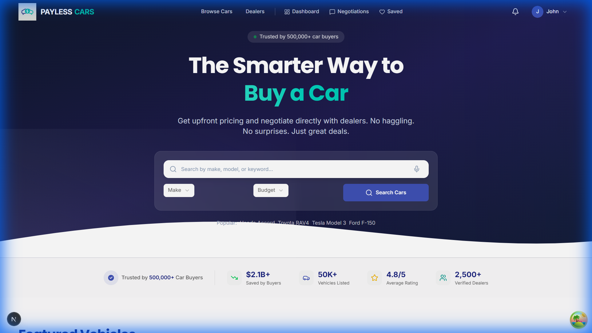
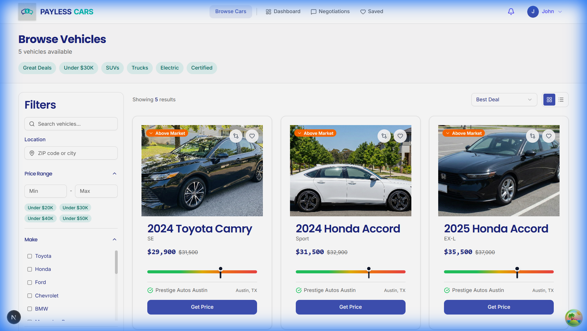
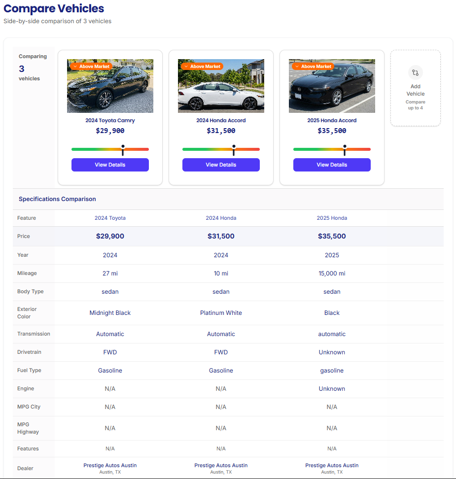
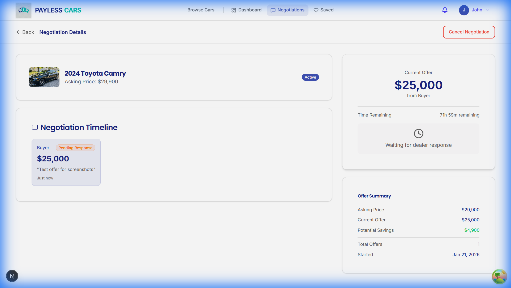
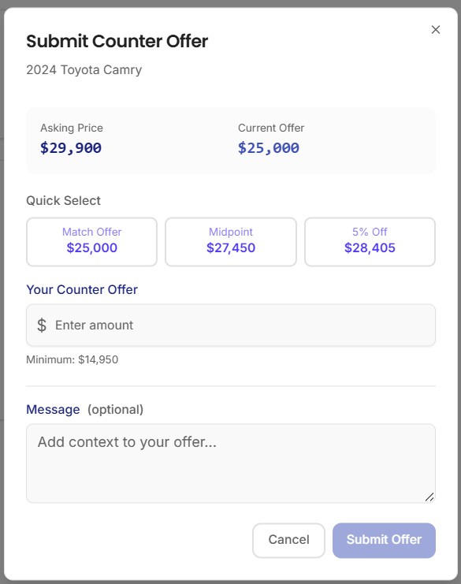
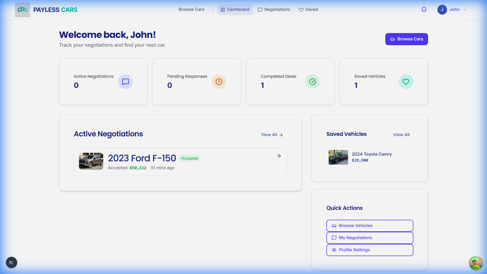
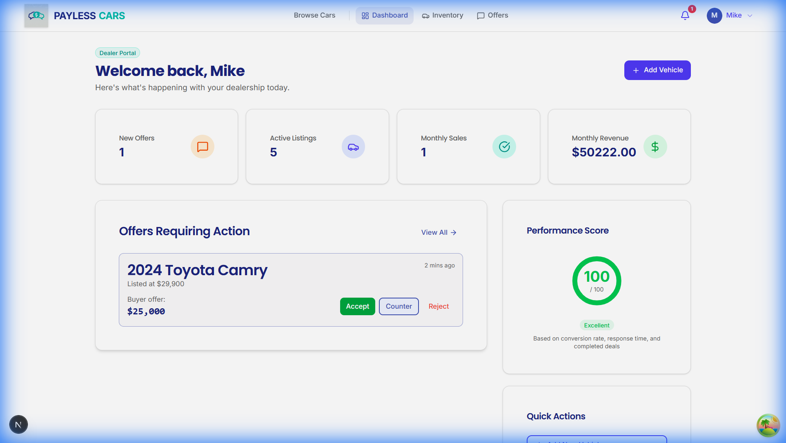
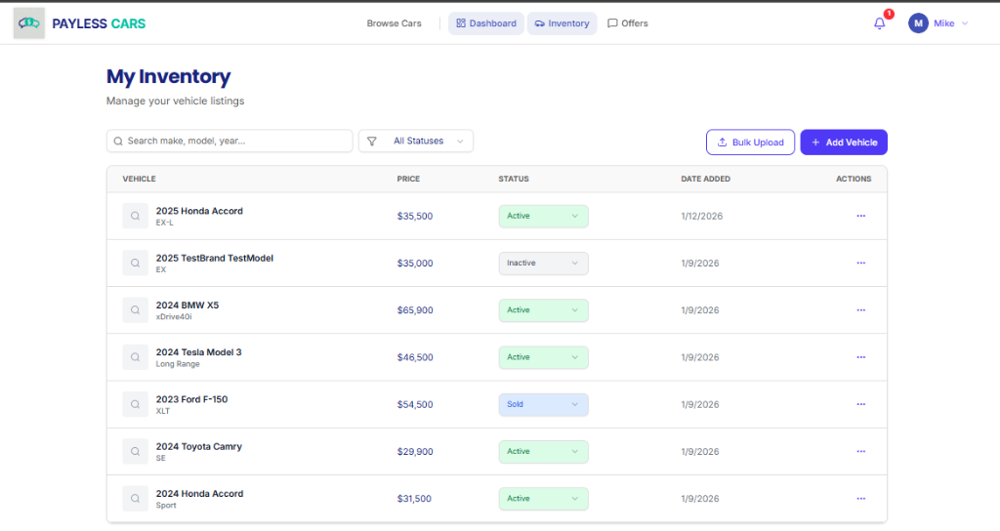
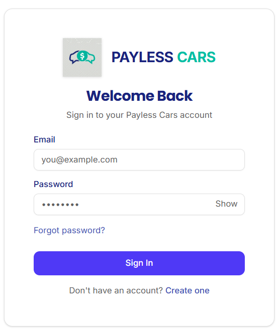

# Payless Cars

[](LICENSE)
[](https://python.org)
[](https://djangoproject.com)
[](https://nextjs.org)
[](https://typescriptlang.org)
[](https://tailwindcss.com)
[](https://postgresql.org)



> **"The Smarter Way to Buy a Car"**
> A full-stack automotive marketplace that eliminates traditional car-buying pain points through transparent pricing and real-time digital negotiation.

---

## 💡 The Problem

Traditional car buying is fundamentally broken:

| Pain Point | Traditional Experience |
|------------|----------------------|
| **Information Asymmetry** | Buyers don't know the dealer's floor price |
| **Adversarial Negotiations** | In-person haggling creates stress and anxiety |
| **Opaque Pricing** | MSRP doesn't reflect actual market value |
| **Time Waste** | Multiple dealership visits required |

**Payless Cars** solves this by creating a digital-first marketplace where buyers can browse inventory, submit offers, and negotiate directly with dealers—all online, with transparent pricing tiers.

---

## 🎯 The Solution

A B2B2C automotive marketplace with:
- **Transparent Pricing**: Buyers see MSRP and asking price; dealers set private floor prices
- **Digital Negotiation**: Real-time offer/counter-offer system replaces in-person haggling
- **Role-Based Dashboards**: Tailored experiences for Buyers, Dealers, and Admins

---

## 🏗️ System Architecture

```
┌──────────────────────────────────────────────────────────────────┐
│                        Frontend (Next.js 14)                     │
│  ┌────────────┐  ┌────────────┐  ┌────────────┐                 │
│  │   Pages    │  │ Components │  │   Store    │                 │
│  │ (App Dir)  │  │   (React)  │  │ (Zustand)  │                 │
│  └─────┬──────┘  └─────┬──────┘  └─────┬──────┘                 │
│        └───────────────┼───────────────┘                         │
│                        ▼                                         │
│                   API Client (Axios + JWT)                       │
└────────────────────────┬─────────────────────────────────────────┘
                         │ REST API
                         ▼
┌────────────────────────────────────────────────────────────────────┐
│                       Backend (Django 5 + DRF)                     │
│  ┌──────────────────────────────────────────────────────────────┐ │
│  │  /auth/  /vehicles/  /dealers/  /negotiations/  /notifications│ │
│  └──────────────────────────────────────────────────────────────┘ │
│                        ▼                                          │
│  ┌────────────┐  ┌────────────┐  ┌────────────┐                  │
│  │   Views    │  │ Serializers│  │  Services  │                  │
│  │ (ViewSets) │  │   (DRF)    │  │  (Logic)   │                  │
│  └─────┬──────┘  └─────┬──────┘  └─────┬──────┘                  │
│        └───────────────┼───────────────┘                          │
│                        ▼                                          │
│                   ORM (Django Models)                             │
└────────────────────────┬──────────────────────────────────────────┘
                         │ SQL
                         ▼
┌────────────────────────────────────────────────────────────────────┐
│                    Database (PostgreSQL / SQLite)                  │
│  accounts • dealers • vehicles • negotiations • notifications     │
└────────────────────────────────────────────────────────────────────┘
```

---

## 🚀 Key Features

### 1. Vehicle Browsing & Comparison
Intuitive filtering and side-by-side comparison tools help buyers find the best deals.

| Browse Vehicles | Vehicle Comparison |
|-----------------|-------------------|
|  |  |

### 2. Real-Time Negotiation System
The core differentiator—buyers and dealers negotiate directly through a structured offer/counter-offer flow.

| Buyer Makes Offer | Dealer Responds |
|-------------------|-----------------|
|  |  |

**Negotiation Flow:**
1. Buyer submits initial offer on a vehicle
2. Dealer receives notification and reviews
3. Dealer can Accept, Reject, or Counter-Offer
4. Buyer responds to counter-offers
5. Process repeats until agreement or rejection

### 3. Role-Based Dashboards
Tailored experiences for each user type.

| Buyer Dashboard | Dealer Dashboard |
|-----------------|------------------|
|  |  |

### 4. Dealer Inventory Management
Full CRUD operations with bulk CSV upload for fleet management.



### 5. Secure Authentication
JWT-based authentication with role-based access control.



---

## 🛠️ Tech Stack

| Layer | Technology | Purpose |
|-------|------------|---------|
| **Frontend** | Next.js 14, React 18, TypeScript | Server-side rendering, type safety |
| **Styling** | Tailwind CSS, Radix UI | Responsive design, accessible components |
| **State** | Zustand | Lightweight global state management |
| **Backend** | Django 5, Django REST Framework | REST API, ORM, admin panel |
| **Auth** | SimpleJWT | Secure token-based authentication |
| **Database** | PostgreSQL (prod), SQLite (dev) | Relational data storage |
| **DevOps** | Docker, Nginx, Gunicorn | Containerization, production serving |

---

## 🎓 What This Project Demonstrates

| Skill Area | Demonstrated Skills |
|------------|---------------------|
| **Full-Stack Development** | React + Django integration, REST API design |
| **Frontend Architecture** | Next.js App Router, TypeScript, component patterns |
| **State Management** | Zustand stores, optimistic updates |
| **Backend Design** | Django ViewSets, serializers, service layer |
| **Authentication** | JWT tokens, role-based access control |
| **Database Design** | Relational modeling, foreign keys, migrations |
| **UX Patterns** | Real-time negotiation, vehicle comparison, dashboards |
| **Code Quality** | Type safety, separation of concerns, clean architecture |

---

## 🏁 Quick Start

### Prerequisites
- Node.js 18+
- Python 3.10+
- npm or yarn

### Setup & Run

```bash
# Clone the repository
git clone https://github.com/Stevenshanmukh/paylesscars.git
cd paylesscars

# Run setup (installs deps, creates DB, seeds data)
# Windows:
.\scripts\fresh-setup.ps1

# Mac/Linux:
chmod +x scripts/*.sh && ./scripts/fresh-setup.sh

# Start the app
# Windows:
.\scripts\start-app.ps1

# Mac/Linux:
./scripts/start-app.sh
```

### Access Points
| Service | URL |
|---------|-----|
| Frontend | http://localhost:3000 |
| Backend API | http://localhost:8000/api/v1/ |
| Admin Panel | http://localhost:8000/admin/ |

### Demo Accounts
| Role | Email | Password |
|------|-------|----------|
| Buyer | buyer1@email.com | pass1234 |
| Dealer | dealer1@premierauto.com | pass1234 |

---

## 📁 Project Structure

```
paylesscars/
├── frontend/          # Next.js 14 React Application
│   ├── src/
│   │   ├── app/       # App Router pages
│   │   ├── components/# React components
│   │   ├── lib/       # API client, utilities
│   │   └── store/     # Zustand state stores
│   └── package.json
├── backend/           # Django 5 REST API
│   ├── apps/
│   │   ├── accounts/  # User authentication
│   │   ├── dealers/   # Dealer management
│   │   ├── vehicles/  # Vehicle listings
│   │   ├── negotiations/# Offer system
│   │   └── notifications/# Alerts
│   ├── config/        # Django settings
│   └── manage.py
├── docs/              # Technical Documentation (212KB+)
├── scripts/           # Setup & utility scripts
└── assets/            # Screenshots & media
```

---

## 📄 Documentation

Comprehensive technical documentation is available in the [docs/](./docs/) directory:

| Document | Description |
|----------|-------------|
| [App Overview](./docs/01_APP_OVERVIEW.md) | Purpose, users, use cases |
| [Features & Business Logic](./docs/03_FEATURES_BUSINESS.md) | All 15 features detailed |
| [Frontend Architecture](./docs/04_FRONTEND_ARCHITECTURE.md) | Next.js patterns, state |
| [Backend Architecture](./docs/08_BACKEND_ARCHITECTURE.md) | Django structure, APIs |
| [API Documentation](./docs/09_API_DOCUMENTATION.md) | All endpoints |
| [Database Schema](./docs/11_DATABASE_DOCUMENTATION.md) | ERD, tables, relationships |
| [Auth & Security](./docs/12_AUTH_SECURITY.md) | JWT, roles, permissions |

---

## 🔮 Future Improvements

> These are stretch goals, not missing features. The app is complete and functional.

- [ ] Payment integration (Stripe)
- [ ] Vehicle history reports (Carfax API)
- [ ] Financing calculator
- [ ] Push notifications
- [ ] Multi-language support

---

## 📝 License

This project is licensed under the MIT License - see the [LICENSE](LICENSE) file for details.

---

<p align="center">
  <strong>Built by <a href="https://github.com/Stevenshanmukh">Steven Shanmukh</a></strong>
</p>
