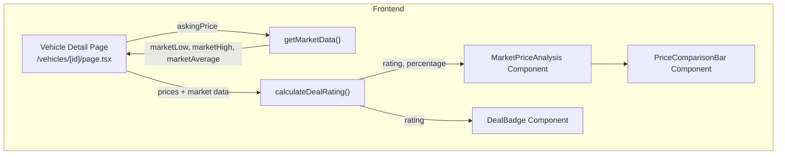
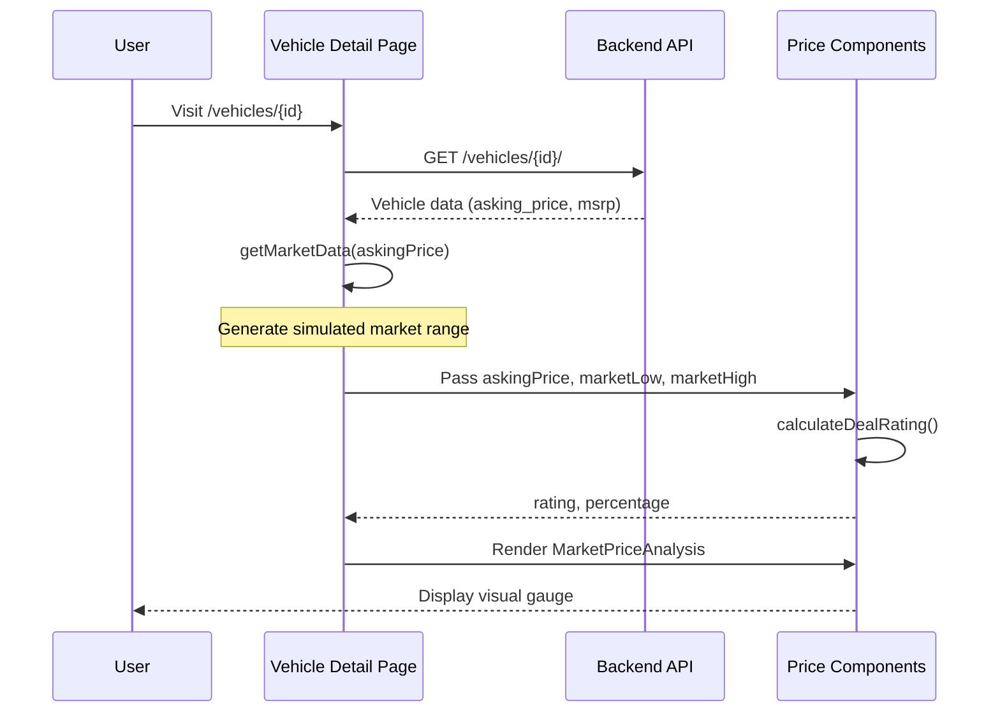

# Price Analysis Feature Documentation

## Overview

The **Price Analysis** feature provides buyers with market intelligence about vehicle pricing, helping them understand if a vehicle is priced fairly compared to similar listings. It displays a visual gauge showing where the asking price falls within the market range.

---

## Architecture



---

## Key Components

### 1. Market Data Generation

**File:** [page.tsx](file:///c:/Users/steve/Downloads/paylesscars/frontend/src/app/vehicles/%5Bid%5D/page.tsx#L46-L53)

```typescript
function getMarketData(askingPrice: number) {
    const variance = askingPrice * 0.15;  // 15% variance
    return {
        marketLow: Math.round(askingPrice - variance),
        marketHigh: Math.round(askingPrice + variance * 0.5),
        marketAverage: Math.round(askingPrice - variance * 0.2),
    };
}
```

> [!NOTE]
> Currently uses **simulated market data** based on the asking price. The variance is 15%, which creates:
> - **Market Low**: Asking price - 15%
> - **Market High**: Asking price + 7.5%
> - **Market Average**: Asking price - 3%

---

### 2. Deal Rating Calculation

**File:** [design-tokens.ts](file:///c:/Users/steve/Downloads/paylesscars/frontend/src/lib/design-tokens.ts#L196-L223)

The `calculateDealRating()` function determines the deal quality based on where the asking price falls within the market range.

#### Algorithm

```typescript
pricePosition = ((askingPrice - marketLow) / (marketHigh - marketLow)) * 100
```

#### Rating Thresholds

| Position % | Rating | Label | Color | Description |
|------------|--------|-------|-------|-------------|
| 0-20% | `great` | Great Deal | Green (#00c853) | Well below market |
| 20-40% | `good` | Good Deal | Lime (#64dd17) | Below market |
| 40-60% | `fair` | Fair Deal | Yellow (#ffd600) | At market average |
| 60-80% | `above` | Above Market | Orange (#ff6d00) | Above market |
| 80-100% | `high` | High Price | Red (#dd2c00) | Well above market |

---

### 3. Visual Components

#### MarketPriceAnalysis

**File:** [price-comparison-bar.tsx](file:///c:/Users/steve/Downloads/paylesscars/frontend/src/components/ui/price-comparison-bar.tsx#L121-L237)

Full price analysis card with:
- Header showing deal rating badge
- Visual gauge (PriceComparisonBar)
- Three data cards: This Vehicle, Market Avg, Potential Savings

#### PriceComparisonBar

**File:** [price-comparison-bar.tsx](file:///c:/Users/steve/Downloads/paylesscars/frontend/src/components/ui/price-comparison-bar.tsx#L32-L118)

Visual gradient bar with:
- Color gradient: Green → Yellow → Orange → Red
- Marker pin showing current price position
- Range labels: "Great Deal" → "High"

---

## Data Flow



---

## Usage Example

```tsx
import { MarketPriceAnalysis } from '@/components/ui/price-comparison-bar';

// On Vehicle Detail Page
const askingPrice = 35000;
const marketData = getMarketData(askingPrice);

<MarketPriceAnalysis
    askingPrice={askingPrice}
    marketLow={marketData.marketLow}      // 29,750
    marketHigh={marketData.marketHigh}    // 37,625
    marketAverage={marketData.marketAverage} // 33,950
    msrp={40000}
/>
```

---

## Where It's Used

| Location | Component | Purpose |
|----------|-----------|---------|
| `/vehicles/[id]` | MarketPriceAnalysis | Full analysis in Price Analysis tab |
| `/vehicles/[id]` | DealBadge | Badge overlay on vehicle image |
| `/compare` | calculateDealRating | Rating for comparison table |
| VehicleCard | calculateDealRating | Mini badge on vehicle cards |

---

## Future Improvements

> [!IMPORTANT]
> The current implementation uses **simulated market data**. Potential enhancements:

1. **Real Market Data API** - Integrate with external pricing APIs (Kelley Blue Book, Edmunds, etc.)
2. **Historical Pricing** - Track price changes over time
3. **Location-Based Pricing** - Adjust market values by geographic region
4. **Vehicle Condition Factor** - Account for mileage, accidents, service history
